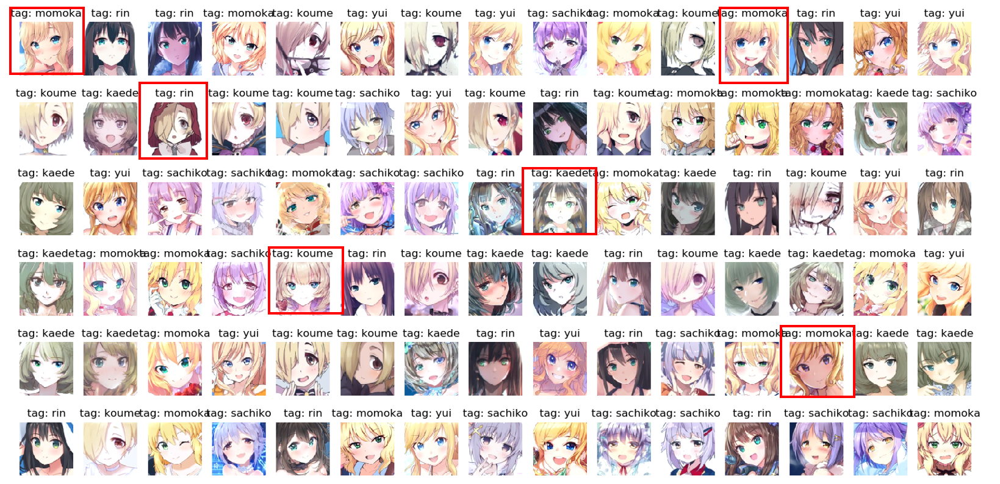

# Classification-of-Animation-Character

Fork https://github.com/kuangliu/pytorch-cifar

Classification of Animation Character, Until now, we have learned 6 characters of idolmaster. 
 
Result 4 Character Use ShuffelNetV2 
Classification Character : 
shirasaka koume 
sibuya rin 
takagaki kaede 
koshimiz sachiko 
 
accuracy = 95.00 (58 images correct in 60 images)
  
Result 6 Character Use ShuffelNetV2 
Classification Character : 
shirasaka koume 
sibuya rin 
takagaki kaede 
koshimiz sachiko 
sakurai mommoka 
ohtsuki yui 
 
accuracy = 93.33 (84 images correct in 90 images)
  
Will be added later

# License
 - https://github.com/kuangliu/pytorch-cifar 
 - https://9bow.github.io/PyTorch-tutorials-kr-0.3.1/beginner/transfer_learning_tutorial.html
 - [lbpcascade_animeface.xml (https://github.com/nagadomi/lbpcascade_animeface/blob/master/lbpcascade_animeface.xml)] is created by [nagadomi/lbpcascade_animeface (https://github.com/nagadomi/lbpcascade_animeface).

Copyright for all images are owned by their respective creators.
