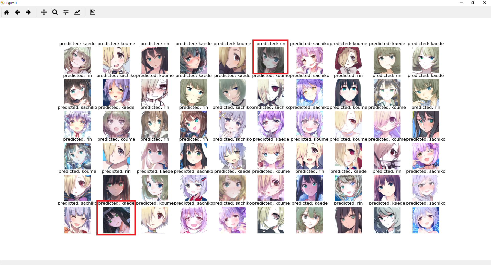

# Classification-of-Animation-Character

Fork https://github.com/kuangliu/pytorch-cifar

Classification of Animation Character, Until now, we have learned 6 characters of idolmaster.

Classification Character :
shirasaka koume
sibuya rin
takagaki kaede
koshimiz sachiko

Result 4 Character Use ShuffelNetV2
 
accuracy = 95.00 (58 images correct in 60 images)
  
Will be added later

# License
 - https://github.com/kuangliu/pytorch-cifar 
 - https://9bow.github.io/PyTorch-tutorials-kr-0.3.1/beginner/transfer_learning_tutorial.html
 -  is created by [nagadomi/lbpcascade_animeface (https://github.com/nagadomi/lbpcascade_animeface).

Copyright for all images are owned by their respective creators.

--------------------------------------------------------------------------------
# Train CIFAR10 with PyTorch

I'm playing with [PyTorch](http://pytorch.org/) on the CIFAR10 dataset.

## Pros & cons
Pros:
- Built-in data loading and augmentation, very nice!
- Training is fast, maybe even a little bit faster.
- Very memory efficient!

Cons:
- No progress bar, sad :(
- No built-in log.

## Accuracy
| Model             | Acc.        |
| ----------------- | ----------- |
| [VGG16](https://arxiv.org/abs/1409.1556)              | 92.64%      |
| [ResNet18](https://arxiv.org/abs/1512.03385)          | 93.02%      |
| [ResNet50](https://arxiv.org/abs/1512.03385)          | 93.62%      |
| [ResNet101](https://arxiv.org/abs/1512.03385)         | 93.75%      |
| [MobileNetV2](https://arxiv.org/abs/1801.04381)       | 94.43%      |
| [ResNeXt29(32x4d)](https://arxiv.org/abs/1611.05431)  | 94.73%      |
| [ResNeXt29(2x64d)](https://arxiv.org/abs/1611.05431)  | 94.82%      |
| [DenseNet121](https://arxiv.org/abs/1608.06993)       | 95.04%      |
| [PreActResNet18](https://arxiv.org/abs/1603.05027)    | 95.11%      |
| [DPN92](https://arxiv.org/abs/1707.01629)             | 95.16%      |

## Learning rate adjustment
I manually change the `lr` during training:
- `0.1` for epoch `[0,150)`
- `0.01` for epoch `[150,250)`
- `0.001` for epoch `[250,350)`

Resume the training with `python main.py --resume --lr=0.01`
